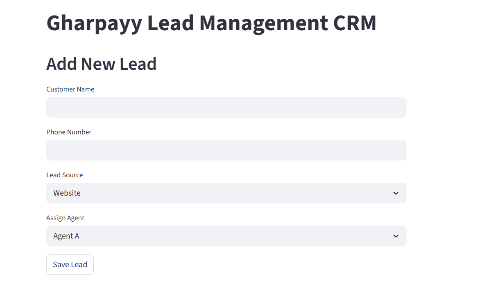

 Gharpayy Lead Management CRM (MVP)

This project is a simple CRM system built using Streamlit and SQLite.

Features:
- Lead capture
- Lead assignment
- Lead pipeline tracking
- Dashboard analytics

Tech Stack:
- Python
- Streamlit
- SQLite
- Pandas

 ## CRM Screenshots

### Add Lead Page

### Lead Table

### Dashboard

## Run the Application

Install dependencies

pip install streamlit pandas

Run the app

streamlit run app.py

Open browser

http://localhost:8501
